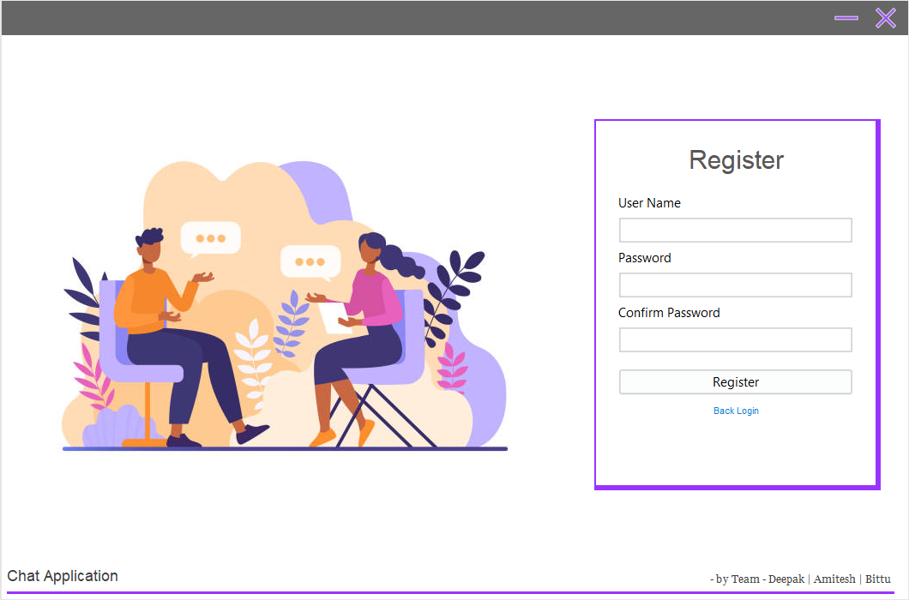

# Chat_App 

This chat app can be used in your **local network** by running one chat_server and getting all chat_clients connect to it.

You can achieve this by specfing the **private ip** of machine that is running the chat_server in the service.java file of chat_client.

## Demo Pics
### chatClient

### chatServer

